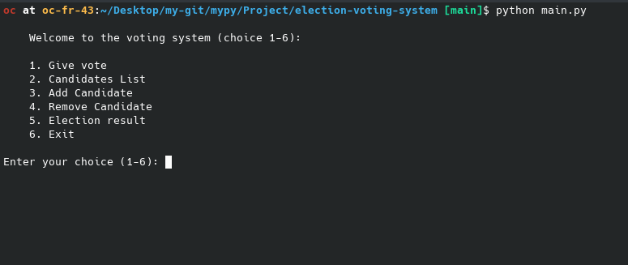

# Election Voting System

Welcome to the Election Voting System, a Python-based application for managing and conducting elections.

## Description

This project is a command-line application developed in Python for managing election processes. It allows administrators to add, remove, and view candidates, as well as conduct the voting process.

## Features

- Add new candidates
- Remove candidates
- View list of candidates
- Conduct voting
- View voting results

## Screenshots

### Main Menu



### Adding a Candidate


### Removing a Candidate


### Viewing Candidates


### Voting Process


## Installation

1. Clone the repository:
   ```bash
   git clone https://github.com/4xrhd/mypy/
    
    ```
2. Navigate to the project directory:

    ```bash
    cd mypy/project/election-voting-system/

    ```
3. Install dependencies:
    ```bash

    pip install -r requirements.txt
    ```
## Usage
1. Run the program:

    ```bash
    python main.py
    ```
2. Follow the on-screen instructions to navigate through the options and conduct the election process.

## Credits
This project was created by [the interviewee infront of you].